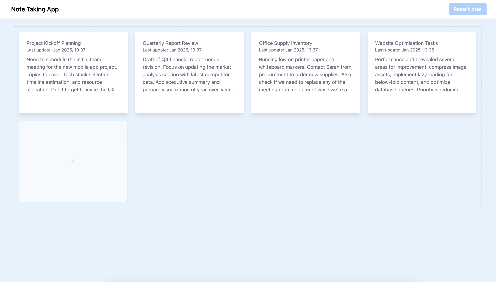
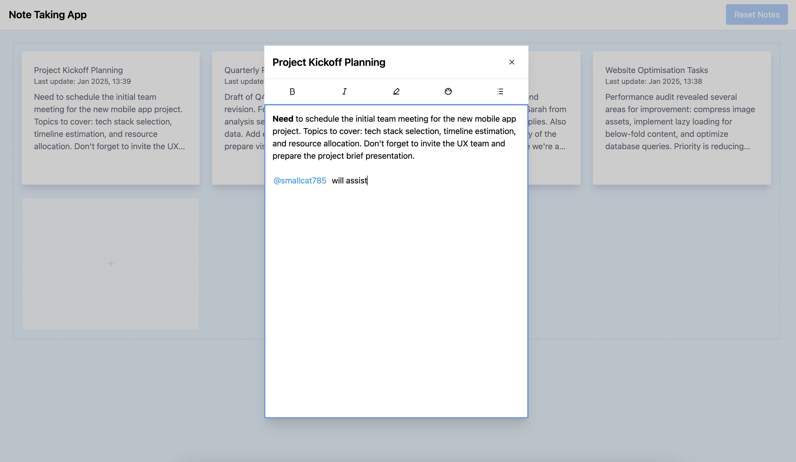

Note Taking App with @mentions
Overview
A collaborative note-taking application built with React and TypeScript, featuring real-time mentions, rich-text editing, auto-saving functionality, and session management. Users can create, edit, and manage notes seamlessly, with support for @mentioning other users to enhance collaboration.

_Main page where you can add new notes by clicking the `+` button._

_Rich text editor. Use @ to mention another user_

Tech Stack
Frontend:
React (Vite)
TypeScript
Tailwind CSS
Testing:
Vitest
State Management:
Zustand
Key Features
Real-time Note Taking: Create and edit notes with instant updates.
Rich-Text Editing: Format text with bold, italic, lists, highlights, and color options.
@Mentions with User Search: Mention other users in your notes using @username, with dynamic search and selection.
Auto-Save Functionality: Automatically save your notes with a debounce mechanism to prevent data loss.
Session Management:
Add Notes: Easily add new notes from the main page by clicking the + button.
Reset Session: Reset your session at any time using the reset button located at the top-right corner.
Responsive Design: Enjoy a modern, responsive interface optimized for all devices.
Collaborative Tools: Enhance teamwork by tagging and mentioning collaborators directly within notes.
Screenshots
Main page where you can add new notes by clicking the + button.

Rich-text editor with @mentions functionality.

Dynamic dropdown for selecting users to mention.

Getting Started
Follow these instructions to set up and run the project locally.

Prerequisites
Node.js (v14 or later)
Yarn package manager
Installation
Clone the Repository

bash
Copy
git clone https://github.com/marshallprogramming/notes-app.git
cd note-taking-app
Install Dependencies

bash
Copy
yarn
Running the Application
Start the Development Server

bash
Copy
yarn dev
Open http://localhost:5173 in your browser to view the app.

Build for Production

bash
Copy
yarn build
Preview the Production Build

bash
Copy
yarn preview
Running Tests
Execute the test suite using Vitest:

bash
Copy
yarn test
Project Structure
css
Copy
notes-app/
├── src/
│ ├── components/
│ │ ├── EditorToolbar/
│ │ ├── MentionDropdown/
│ │ ├── icons/
│ │ └── ...
│ ├── hooks/
│ │ ├── useCaretMention.ts
│ │ ├── useMentionsStore.ts
│ │ ├── useNotesStore.ts
│ │ └── ...
│ ├── services/
│ │ └── users.ts
│ │ └── notes.ts
│ │ └── session.ts
│ ├── pages/
│ │ └── MainPage.tsx
│ ├── App.tsx
│ └── main.tsx
├── public/
│ └── ...
├── screenshots/
│ └── ...
├── tests/
│ └── ...
├── styles/
│ └── globals.css
├── README.md
├── package.json
└── ...
Usage
Adding a New Note
Navigate to the Main Page:

Upon launching the app, you'll be greeted with the main page displaying existing notes.
Add a New Note:

Click the + button located prominently on the main page.
This action opens the rich-text editor where you can compose your note.
Editing a Note
Open the Editor:

Click on an existing note to open it in the editor.
Format Your Text:

Use the toolbar to apply formatting options such as bold, italic, lists, highlights, and text colors.
@Mention Users:

Type @ followed by a username to mention a user.
A dropdown will appear with matching usernames; select the desired user to insert a mention.
Resetting the Session
Reset Button:
Located at the top-right corner of the application.
Clicking this button will reset your session, clearing all notes and starting fresh.
Contributing
Contributions are welcome! Please follow these steps to contribute:

Fork the Repository

Create a New Branch

bash
Copy
git checkout -b feature/YourFeatureName
Commit Your Changes

bash
Copy
git commit -m "Add your detailed description here"
Push to the Branch

bash
Copy
git push origin feature/YourFeatureName
Open a Pull Request

License
This project is licensed under the MIT License.

Acknowledgements
Inspired by modern collaborative tools and rich-text editors.
Thanks to the open-source community for providing invaluable resources and libraries.
Contact
For any inquiries or feedback, please contact services@marshallprogramming.com
